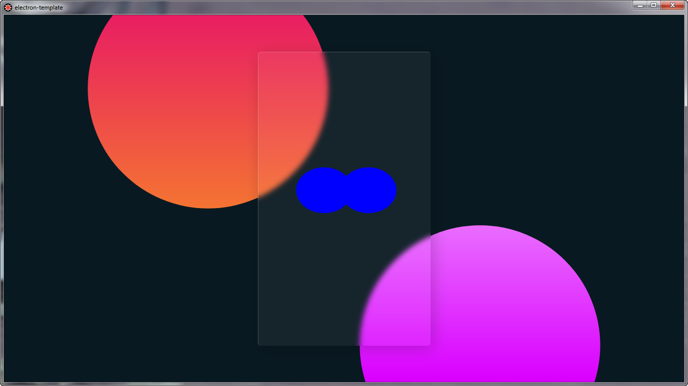
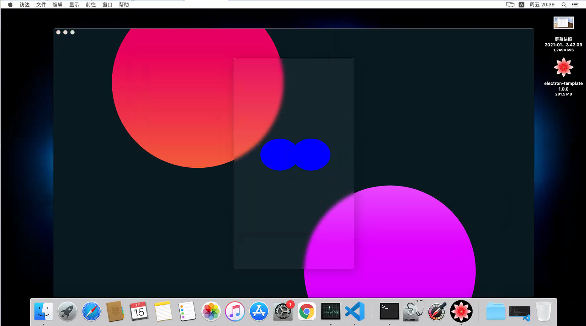
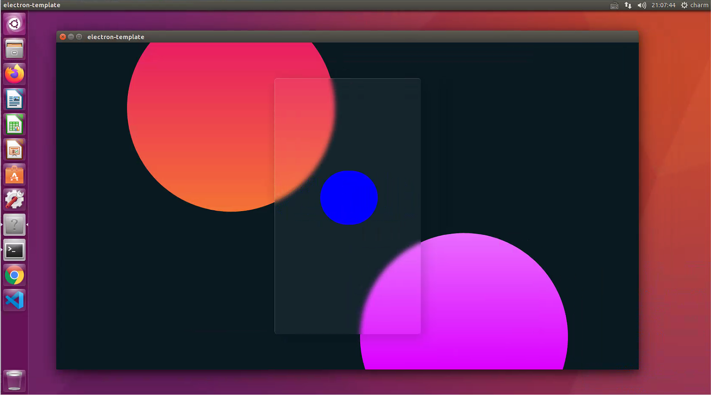

# electron-template

## 写在前面

为了打包体积尽可能的小，所以electron使用了较低的版本，如需使用高版本的electron，自行升级electron版本

## 诞生背景

本仓库诞生的目的是解决从 web 网站搬到到电脑应用程序的问题,可打包 windows,mac 和 linux,且操作简单

## 快速上手

```shell
npm --registry https://registry.npm.taobao.org install
npm run dist:win
```

打包好后的文件在项目根目录的 out 文件夹下

## 操作说明

1. 把 package.json 和 main.js 里面的 electron-template 全部替换成你需要的名字,把 my-app/public 目录下的图标全部换成你的图标,注意图片格式

2. 安装依赖环境: `npm --registry https://registry.npm.taobao.org install`  
   如果遇到安装失败或者打包后闪退的问题,请重新安装 electron

3. 不建议使用网络加载的模式引入应用程序内容,如果非要通过 url 加载内容,需要在 main.js 里将`` mainWindow.loadURL(`file://${__dirname}/mya-pp/build/index.html`); ``替换成`mainWindow.loadURL("put your url here");`.
   注意:如果对方没有网络,那么你的应用程序打开就会白屏

4. 打包,不同平台的包只能去不同平台去打包,比如打 mac 版本的包,需要在 mac 电脑上打包,打 linux 包需要在 linux 系统上打包,但 linux 的包同时适用 ubuntu 和 redHat 两个 linux 分支版本

`windows`

```shell
npm run dist:win
```

`mac`

```shell
npm run dist:mac
```

`linux`

```shell
npm run dist:linux
```

## electron 应用案例

[Visual Studio Code](https://www.electronjs.org/apps/visual-studio-code)  
[postman](https://www.electronjs.org/apps/postman)  
[GitHub Desktop](https://www.electronjs.org/apps/github-desktop)  
[GitBook](https://www.electronjs.org/apps/gitbook)
[MongoDB Compass](https://www.electronjs.org/apps/mongodb-compass)  
[Atom](https://www.electronjs.org/apps/atom)  
[更多案例](https://www.electronjs.org/apps)

## electron 官网

[https://www.electronjs.org/](https://www.electronjs.org/)

## 效果预览

`windows`  


`mac`  


`linux`  


## 关联链接

[快速打包 web 页面到移动端 app](https://github.com/zhoushoujian/cordova-template)

[express + mongodb + redis + jwt + typescript 项目模板](https://github.com/zhoushoujian/typescript-express-templates)

[React + Redux + typescript 项目模板](https://github.com/zhoushoujian/typescript-react-templates)

[nextjs + redux + express + less 服务端渲染项目模板](https://github.com/zhoushoujian/nextjs)

[taro 小程序项目模板](https://github.com/zhoushoujian/taro)

## License

[MIT](./LICENSE)
